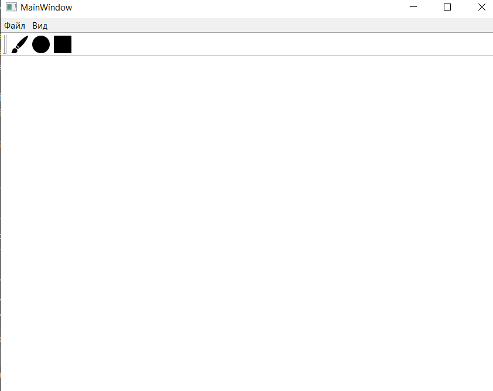
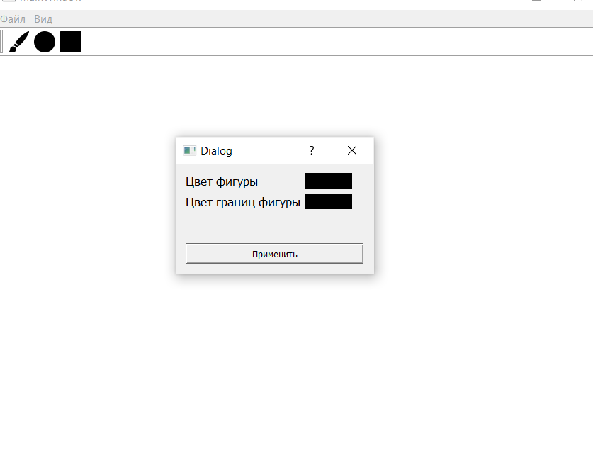
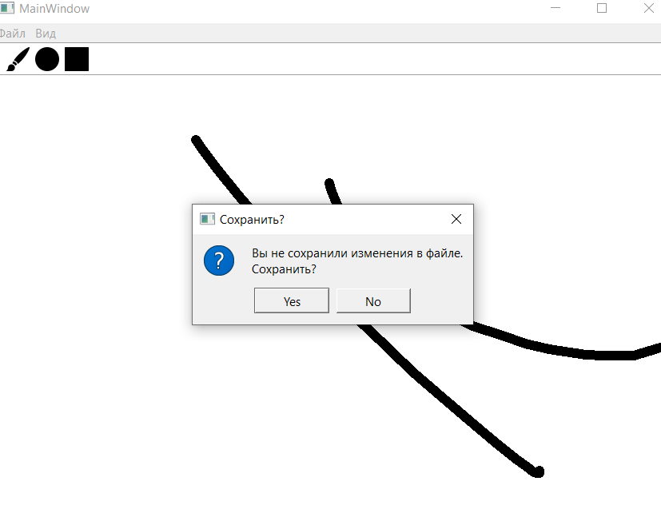

Графический редактор на основе библиотеки PyQT. Программа будет иметь основные функции графического редактора.

**_Основные цели проекта:_**
- чтобы люди не разбирались в приложении и все было просто устроено
- увеличить количество людей, которые рисуют
- обеспечить простоту и удобство при работе с графическими изображениями

1. При запуске вас встречает основной дисплей и меню-бар, на котором находятся основные функции редактора

   
2. В "Файл" есть несколько функций такие как:

"Сохранить" - можно сохранить свое творчество
"Открыть" - можно отрыть фотографию и рисовать на ней
"История" - можно открыть последние открытые файлы(использование БЗ)
   

   
"Очистить" - очистить основной дисплей
"Выйти" - принудительно выйти из приложения
3. Можно выбрать кисть и настроить ее(правой кнопкой мыши)(использование диалоговых окон)

4. Выбрать фигуру и начать ею пользоваться. Можно регулировать цвет(с помощью диалоговых окон)

5. Ластик
6. Выделение

# **Фишки приложения**

7. Вас приложение будет предупреждать о сохранении файла

8. Перемещение тул бара

