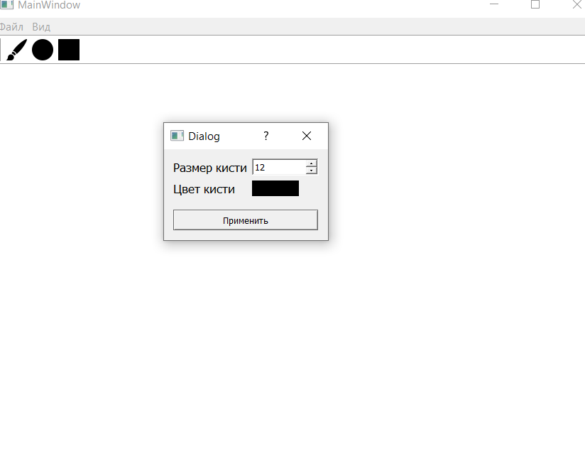
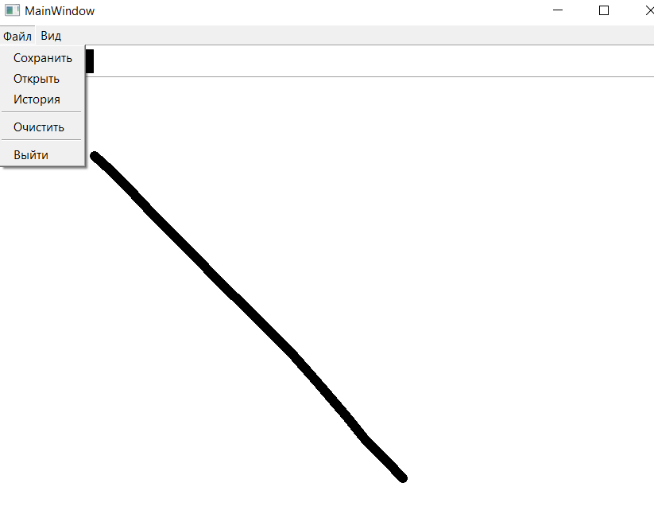
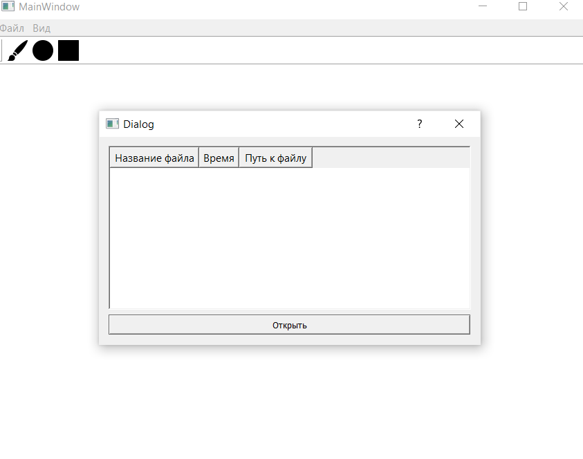

Графический редактор на основе библиотеки PyQT. Программа будет иметь основные функции графического редактора.

**_Основные цели проекта:_**
- чтобы люди не разбирались в приложении и все было просто устроено
- увеличить количество людей, которые рисуют
- обеспечить простоту и удобство при работе с графическими изображениями

**_Основные действия, производимые в этом приложении:_**
- создания графического файла
- сохранения изображения в графическом файле на жёстком диске
  
  
- выбор размера кисти
 
- выбор цвета кисти
 
- выбор фигуры
  
**_Частные случаи, для которых требуются специализированные инструменты ввода/редактирования:_**
- круг, эллипс
- квадрат, прямоугольник
- треугольник

**_Работа с объектами:_**
- создание
- редактирование узлов
- копирование, вставка
- перенос
- клонирование
- вращение
- удаление